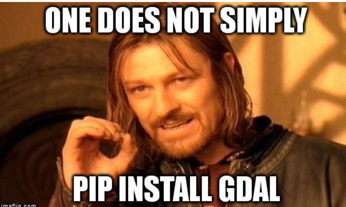

# Week 10 - We are Really on to Something Here:

### A lot to cover today

- Remember: - Tony does topical small sessions on specific topics as part of the Pangeo/Open Data Cube outreach project

---
---

- synergies between the cloud and hpc
- high speed data movement
- Remote Sensing Catalogs of pixels at our service
    - `Sentinel` L2A
    - old Landsat 8 TOA
    - brand new USGS `Landsat Collection2` - Surface Reflectance in UTM
        - coming soon Albers
    - Experimental `Harmonized Landsat-Sentinel`
    - nearFuture Suomi NPP will carry five science instruments 
        - Suomi NPP is the first satellite mission to address the challenge of acquiring a wide range of land, ocean, and atmospheric measurements 
- Synergies with google maps and geojson.io
- NO LICENSE FEES
- A support group and a PANGEO community with really smart people to cheat off
- A talented pool of folks from SD Universities - pride
- Scientists with noble missions - wonderful!
- We can write `our own apps` that do just what we want them to do!
- get rid of WINDOWS and all of its poor engineering.
- tell Claudia - we can and do run PANGEOi/jupyter on Denali and Tallgrass

---

# Introducing Self-Directed Labs
- more to come ...


## Next 2 classes - Yaml
```
Today: '2-16-2021'
  Title: 'Cloud Based Sentinel CogS'
  Sensor: 'Sentinel'
  Data_Tier: 'L2A'
  Projection: 'UTM'
  Science_Application: 'Compositing'
  Sandbox: 'pangeo.chs.usgs.gov'
  Status: 'Exploration early R&D'
  Purpose: 'Class Example'
  AWS_Document: 'https://registry.opendata.aws/sentinel-2-l2a-cogs/'
  AOI: 'Maine'
  City: 'Augusta'
  Subtopics: ['Browse', 'Tiles', 'Clouds', 'Geojson', 'Google_Maps']
  Git_Repo_Ref: 'https://github.com/tonybutzer/composite/tree/main/00-notebooks/00-wip-geojson-viewer'
```

  

## Future Classes

- Pangeo Objects - STAC - Xarray
- Map Projections - warp speed
    - geopandas intersections - operations- 
        - new_gdf = gdf.loc[gdf.within(atlanta_shapely)]
        - new_gdf = gdf.loc[gdf.intersects(atlanta_shapely)]
- Compositing using cloud assets
- Water model evaluation on Denali with stream guage integration and using PANGEO - open source!
- Managing python packages in the evolving Pangeo opinionated ecosystem
    - docker, conda, pip -- "GDAL" -- "GDAL"
    - Do not pip install gdal, do not install GDAL inside a virtual-env. Instead, use Conda.
---


## The DEMOs
- lets begin

```
https://pangeo.chs.usgs.gov/user/butzer@contractor.usgs.gov/notebooks/opt/composite/00-notebooks/00-wip-geojson-viewer/98-cloud-zealot-short-list.ipynb

--- 
Alias: jovyan
Mission: "Help Bill Gates save the planet with better technology"
Notebook: "https://pangeo.chs.usgs.gov/user/butzer@contractor.usgs.gov/notebooks/opt/composite/00-notebooks/00-wip-geojson-viewer/98-cloud-zealot-short-list.ipynb"
Partners: 
  - AWS
  - ESA
  - "Pangeo Community"
Purpose: "Build advocacy for the cloud and image processing"
Sandbox: pangeo.chs.usgs.gov
Title: "Cloud Zealot Engagement Strategy"
User: jupyter-pangeo
What: "tl;dr: it’s a play on jovian which means a Jupiter-like planet"
Python_Packages:
  - pandas
```

### Demo 2 

http://www.yamllint.com/

```
--- 
Notebook: 00-geojson-viewer-panel.ipynb
Purpose: "Improve understanding of cool panel widget apps"
Python_Packages: 
  - panel
  - folium
  - json
  - geojson
Sandbox: pangeo.chs.usgs.gov
User: butzer@contractor.usgs.gov
github: composite
path: opt/composite00-notebooks/00-wip-geojson-viewer
```

## END OF WEEK10

---
# Week 11
## HLS - Next WEEK

## Brave Sir Logan and The CMR 
- Common Metadata Repository (CMR) - Earthdata - NASA
- Logan says register here:
    - I think you just need an earth data log in 
    - https://urs.earthdata.nasa.gov/


## geojson.io and google - measure distances - klm 

- demo cut and paste into geojson.io
- talk about importing as a kml in google maps
- all you need is a chromebook to do science.


[https://www.google.com/maps/d/?hl=en](https://www.google.com/maps/d/?hl=en)


### HLS GRID


---
## Sentinel
- klm grid and google maps


## Composite Work

### Pangeo Startup Sequence


---
## Landsat-8 TOA
## Simple Animations using Landsat-8 TOA


---
## Denali integration Scenarios

- composite on AWS --- Characterize on Denali or Tallgrass
- Water Evaporation and Runoff on AWS --- Evaluate Water Balance Model fidelity on Denali using Stream Guage Data

    - brand new USGS `Landsat Collection2` - Surface Reflectance in UTM
        - coming soon Albers
    - Experimental `Harmonized Landsat-Sentinel`
    - nearFuture Suomi NPP will carry five science instruments 
        - Suomi NPP is the first satellite mission to address the challenge of acquiring a wide range of land, ocean, and atmospheric measurements 
- Synergies with google maps and geojson.io
- NO LICENSE FEES
