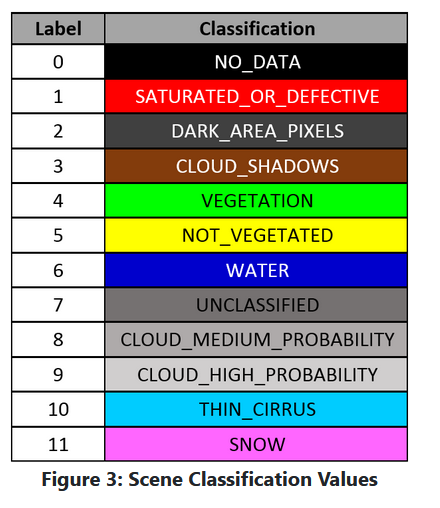

# Week 14 - Olena -- matplotlib and pandas

- notes here:

### Overview

- Olena and Steffi Model Verification
    - Significant as it directly and rapidly improves our scalable model code for Evapo
- Logan HLS 1.4 and 1.5 Research
- 

---

[https://www.usgs.gov/center-news/calibration-test-site-becomes-agricultural-hotspot?qt-news_science_products=2#qt-news_science_products](https://www.usgs.gov/center-news/calibration-test-site-becomes-agricultural-hotspot?qt-news_science_products=2#qt-news_science_products)

---
### Open Data Cube - glimpse

http://10.12.68.246:8080/notebooks/composite/30-cubebox-helper/00_tony_class_exhibit_learning_odc_claibration_site_Sentinel_2.ipynb

